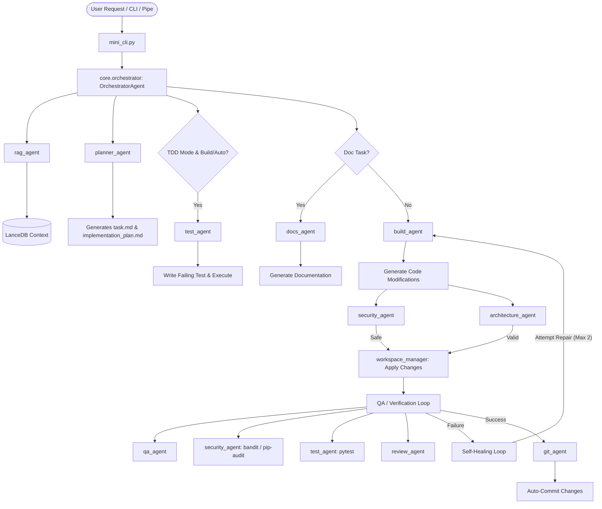

# 🌌 Mini-CLI Agent (v0.01)

[](#)
[](#)
[](#)

Mini-CLI is an autonomous, multi-agent AI coding assistant designed to execute complex development tasks. Orchestrated by a central lead agent, the system coordinates 21 specialized sub-agents to construct, test, validate, and secure codebases. Running under an async execution environment, Mini-CLI provides robust security constraints, automated Test-Driven Development (TDD) pipelines, self-healing loops, and deep workspace isolation.

---

## 🏗️ System Architecture

Mini-CLI utilizes a hierarchical multi-agent structure. The **Orchestrator** manages global state, evaluates the rate-limit guards, dynamically schedules specialized agents, and executes the TDD/Self-Healing loops.



---

## ⚡ Key Features

1. **Plan vs. Build vs. Auto Modes**
   - **Plan (`plan`)**: Analyzes requests without changing the files. Generates architectural breakdowns into `task.md` and `implementation_plan.md`.
   - **Build (`build`)**: Creates code and reviews diffs interactively, prompting you `[y/n]` for each modification before writing to the disk.
   - **Auto (`auto`)**: Full automation mode. Displays diffs and writes directly to files without interactive confirmation.
2. **Role-based Collaboration & Semantic Routing**
   - Allocates tasks to sub-agents via **LLM-based semantic routing** (`_route_task_semantically`). Falls back to a robust keyword-matching mechanism on network failure.
   - **Human-in-the-Loop (HITL):** Enables sub-agents to query the user interactively during code generation using `[ASK_USER: <question>]`. The orchestrator halts execution, prompts the user, collects the reply, and resumes implementation.
3. **Cross-Language Testing & CI/CD Validation**
   - `TestAgent` automatically detects the workspace project environment to run tests via `npm test` (Node.js), `go test ./...` (Go), `cargo test` (Rust), `phpunit` (PHP), or `pytest` (Python).
   - `CicdAgent` validates GitHub Actions (`.github/workflows/*.yml`) and GitLab CI/CD configs (`.gitlab-ci.yml`) for YAML errors and flags unpinned third-party actions.
4. **Closed-Loop Self-Healing**
   - If tests fail, syntax errors occur, or vulnerabilities are flagged, the orchestrator retrieves the log context and instructs the agent to fix the issues automatically (up to 2 retry attempts).
5. **Security & Architecture Safeguards**
   - **Workspace Isolation**: Prevents the agent from writing to, reading from, or executing commands in directory trees outside the workspace. *The agent cannot target its own source code folder.*
   - **SAST & Vulnerability Scans**: Executes automated static security checks via **Semgrep** (deep static scanning), **Bandit** (Python specific), and dynamic dependencies scans via **pip-audit**.
   - **Secret Protection**: Identifies and blocks API keys, tokens, and hardcoded secrets in RAM-only mode, and redacts/masks secrets in logs and database stores.
   - **Structural Audits**: Validates modifications against structural constraints and design patterns (SOLID, Clean Architecture).
6. **Model Context Protocol (MCP) Integration**
   - Fully compliant stdio-based MCP Client powered by the official `mcp` SDK to connect external services (like Jira, GitHub, Slack). Configurations are loaded from `.mini_cli_config.json` under `"mcp_servers"`.
7. **Local RAG Vektor Database (LanceDB)**
   - Performs semantic vector search on LanceDB tables using cosine similarity generated dynamically by the active provider. Safely falls back to a Jaccard keyword search with exponential recency decay (30 days half-life).
8. **Language Server Protocol (LSP) Integration**
   - Launches a background `pylsp` server. Resolves definitions, references, and class dependencies dynamically to feed context to the generator.
9. **Multi-Provider Fallbacks**
   - Supports local models (Ollama, LM Studio) and cloud models (OpenAI, Anthropic, Gemini). Automatically falls back to healthy endpoints.

---

## 🛠️ Specialized Agent Matrix

The system includes 21 purpose-built sub-agents loaded lazily on demand:

| Agent Name | Module / Identifier | Key Responsibility |
| :--- | :--- | :--- |
| **Orchestrator** | `core.orchestrator` | Coordinates workflows, runs TDD phases, handles Self-Healing loops. |
| **RAGAgent** | `agents.rag_agent` | Resolves semantic workspace queries using LanceDB. |
| **BuildAgent** | `agents.build_agent` | Focuses on generative programming tasks and code additions. |
| **QAAgent** | `agents.qa_agent` | Validates syntax, runs code formatters/linters. |
| **TestAgent** | `agents.test_agent` | Generates testing frameworks (pytest, etc.) and runs them. |
| **GitAgent** | `agents.git_agent` | Creates semantic commits for applied modifications. |
| **ArchitectureAgent** | `agents.architecture_agent` | Blocks code smells and circular dependencies; enforces design patterns. |
| **ResearchAgent** | `agents.research_agent` | Performs secure web research using DuckDuckGo APIs. |
| **SecurityAgent** | `agents.security_agent` | Scans for hardcoded keys, Bandit vulnerabilities, and package exploits. |
| **DocsAgent** | `agents.docs_agent` | Updates Markdown documentation, docstrings, and Mermaid diagrams. |
| **ApiAgent** | `agents.api_agent` | Compiles API schemas, typings (TypeScript/Rust/Pydantic). |
| **BrowserAgent** | `agents.browser_agent` | Drives browser actions and Playwright/Cypress E2E tests. |
| **CicdAgent** | `agents.cicd_agent` | Reads build-failure logs and optimizes CI/CD YAML configurations. |
| **DatabaseAgent** | `agents.database_agent` | Generates safe database migrations (SQL, Prisma, Alembic). |
| **DependencyAgent** | `agents.dependency_agent` | Resolves package conflicts and manages module requirements. |
| **DockerAgent** | `agents.docker_agent` | Writes multi-stage Dockerfiles and Docker Compose profiles. |
| **FrontendAgent** | `agents.frontend_agent` | Inspects styling guides, accessibility (A11y), CSS, and Tailwind. |
| **PlannerAgent** | `agents.planner_agent` | Breaks requirements down into milestones (`task.md`). |
| **ProfilerAgent** | `agents.profiler_agent` | Profiles CPU load, memory footprints, and databases. |
| **ReviewAgent** | `agents.review_agent` | Evaluates complexity and refactors code blocks. |
| **SkillCreatorAgent** | `agents.skill_creator_agent` | Implements new tool wrappers and CLI commands dynamically. |
| **VerifyAgent** | `agents.verify_agent` | Performs complete system sanity and health verification. |

### 🔍 Detailed Agent Workings

Here is a detailed breakdown of how each sub-agent operates and the tools/methods they employ:

#### Configurable Agents (CLI Selection Menu):
1. **RagAgent (`agents/rag_agent.py`):**
   * **Functionality:** Resolves semantic workspace queries using **LanceDB** as a local vector database and local embeddings (e.g. `nomic-embed-text` via Ollama) to retrieve relevant code context for the active task.
2. **BuildAgent (`agents/build_agent.py`):**
   * **Functionality:** Focuses on generative programming tasks and code additions based on tasks and plans. Employs a custom block format (`<<<FILE_START: ...>>>`) for writing files, includes guards against path traversal, and uses a fault-tolerant JSON fallback parser (`json-repair`).
3. **TestAgent (`agents/test_agent.py`):**
   * **Functionality:** Writes automated unit tests (e.g. with `pytest`) during the TDD RED phase, runs the entire test suite asynchronously in a sandboxed environment, and reports failure logs back to the orchestrator for self-healing.
4. **ArchAgent / ArchitectureAgent (`agents/architecture_agent.py`):**
   * **Functionality:** Validates code modifications against design principles (SOLID, Clean Architecture, Separation of Concerns) and blocks architectural regressions or spaghetti code with a `FAIL`.
5. **DocsAgent (`agents/docs_agent.py`):**
   * **Functionality:** Updates Markdown documentation (like READMEs), inserts standardized docstrings into code files, and generates Mermaid.js diagrams to visualize flows and architectures.
6. **ApiAgent (`agents/api_agent.py`):**
   * **Functionality:** Compiles API schemas, typings (TypeScript/Rust/Pydantic), and validation code (Zod, Pydantic) based on endpoints and controller definitions.
7. **BrowserAgent (`agents/browser_agent.py`):**
   * **Functionality:** Creates and runs Playwright/Cypress end-to-end (E2E) browser tests to validate visual and functional UI integrity.
8. **CicdAgent (`agents/cicd_agent.py`):**
   * **Functionality:** Reads build-failure logs (e.g. from GitHub Actions, GitLab CI) and produces corrected YAML configs.
9. **DbAgent / DatabaseAgent (`agents/database_agent.py`):**
   * **Functionality:** Generates safe database migrations (SQL, Prisma, Alembic) for up- and down-migrations (rollbacks) and suggests performance-enhancing indices.
10. **DepAgent / DependencyAgent (`agents/dependency_agent.py`):**
    * **Functionality:** Audits package requirements (`requirements.txt`, `package.json`) for outdated modules, dependency conflicts, and known vulnerabilities (CVEs).
11. **DockerAgent (`agents/docker_agent.py`):**
    * **Functionality:** Writes optimized, multi-stage Dockerfiles and Docker Compose profiles prioritizing security (Alpine/Distroless, non-root users, minimal image footprint).
12. **FrontendAgent (`agents/frontend_agent.py`):**
    * **Functionality:** Optimizes styles, responsive layouts (Mobile-First), and accessibility (A11y/ARIA labels, keyboard navigation).
13. **PlannerAgent (`agents/planner_agent.py`):**
    * **Functionality:** Breaks user instructions into milestones and generates/maintains `task.md` (boundaries/scope) and `implementation_plan.md` (sequenced checklist).
14. **ProfilerAgent (`agents/profiler_agent.py`):**
    * **Functionality:** Analyzes resource efficiency, profiling CPU footprints, memory leaks, database lookup patterns, and identifying computational bottlenecks.
15. **ReviewAgent (`agents/review_agent.py`):**
    * **Functionality:** Conducts deep code reviews in four areas (Security, Architecture, Logic/Performance, Conventions). Flags issues as `[KRITISCH]` or `[WARNUNG]` to trigger the self-healing workflow.
16. **SkillAgent / SkillCreatorAgent (`agents/skill_creator_agent.py`):**
    * **Functionality:** Dynamically designs, writes, and integrates new agent skill files in Python upon user HITL (Human-in-the-Loop) approval while enforcing directory path safety constraints.

#### Other System Agents:
* **QAAgent (`agents/qa_agent.py`):** Runs static code analysis and auto-formatting checks using `Ruff`.
* **SecurityAgent (`agents/security_agent.py`):** Scans code modifications in memory for secrets, runs static audits using `Bandit`, and audits package lists for vulnerabilities using `pip-audit`.
* **ResearchAgent (`agents/research_agent.py`):** Performs secure web research using DuckDuckGo, sanitizing results to prevent prompt injection attempts.
* **VerifyAgent (`agents/verify_agent.py`):** Conducts complete system health checks (checking for `.env` files and verifying syntax compilation via `compileall`).
* **GitAgent (`agents/git_agent.py`):** Stages files and performs automated commits with semantic messages upon user confirmation.

---

## 🔒 Token Security Architecture

Mini-CLI is built using "Security-by-Design" principles to guarantee that sensitive credentials and API keys (such as `GEMINI_API_KEY`, `OPENAI_API_KEY`, and `ANTHROPIC_API_KEY`) are never exposed or leaked:

1. **In-Memory Execution (RAM-only)**: API keys are loaded dynamically into the running process's memory and transmitted securely via HTTPS/TLS to the official provider endpoints. They are never written to disk, local databases (e.g., LanceDB), run-logs, or telemetry files.
2. **Workspace Isolation**: The agent is restricted from using its own source directory as a workspace. This boundary ensures the agent cannot read, edit, or commit its own environment configurations (like `.env`).
3. **Automated Secret Scanning (`Security-Agent`)**: Before any file modification is written to disk, the `Security-Agent` scans the planned diff in memory for hardcoded keys or passwords. If a pattern matches a secret, the system immediately blocks the write operation and alerts the user.
4. **Isolated Containerization**: The provided Docker support (`docker-compose.yml`) allows passing keys into a sandboxed environment via runtime environment variables, keeping host credentials separated from the development directory.

*Tip: We recommend restricting API keys in your cloud console (e.g., Google AI Studio) to only the necessary model services and setting quota thresholds (daily caps) to mitigate any runaway loops.*

---

## 🚀 Quick Start Guide

### 1. Requirements & System Dependencies
- Python 3.10 or higher.
- Under Linux (e.g. Bazzite / Fedora / Ubuntu), make sure to install system-level packages (like `python3-pip`, `git`).
- (Optional) Language Server Protocol: `python-lsp-server` (installable via `pip`).

### 2. Installation
Clone the repository and set up a virtual environment:
```bash
git clone https://github.com/your-username/mini-cli.git
cd mini-cli
python -m venv .venv
source .venv/bin/activate
pip install -r requirements.txt
```

### 3. Setting Up LLM Providers
Set your environment variables depending on your chosen API provider:
```bash
# Cloud Providers
export GEMINI_API_KEY="your-gemini-key"
export ANTHROPIC_API_KEY="your-anthropic-key"
export OPENAI_API_KEY="your-openai-key"

# Local Providers (Ensure Ollama or LM Studio is running)
# Ollama: default endpoint http://localhost:11434
# LM Studio: default endpoint http://127.0.0.1:1234
```

---

## 📖 Usage Manual

You can run Mini-CLI in **Command Execution Mode** or **Interactive REPL Mode**.

### A. Command Execution Mode
Execute a single instruction directly from your terminal.

```bash
# Analyze a requirement and output a development plan (Plan Mode - Default)
python mini_cli.py "Create a web scraper utility in python" --mode plan

# Generate and automatically execute code in interactive build mode
python mini_cli.py "Write a class to compute Fibonacci sequences" --mode build --provider openai

# Run fully autonomously using a specific provider
python mini_cli.py "Refactor database connection logic to use context managers" --mode auto --provider gemini
```

#### Unix Pipes Support
Pipe information straight into the CLI:
```bash
cat error.log | python mini_cli.py "Explain why this stack trace failed" --mode plan
```

---

### B. Interactive REPL Mode
Launch the REPL by running the script without a task argument:
```bash
python mini_cli.py
```

Upon launching, the CLI will guide you to select a workspace directory. **Crucial restriction: you cannot use the agent's source code folder (`mini-cli`) as a workspace.**

#### Available REPL Commands
Type `/help` in the REPL to display the command menu:

| Command | Argument | Description |
| :--- | :--- | :--- |
| `/help` | None | Displays the interactive menu of commands. |
| `/provider` | `<name>` | Changes the model provider (`ollama`, `gemini`, `anthropic`, `openai`, `lmstudio`). |
| `/mode` | `<name>` | Swaps the execution mode (`plan`, `build`, `auto`). |
| `/language` | `<lang>` | Changes interface language (`en`, `de`). |
| `/verify` | None | Performs a comprehensive system validation. |
| `exit` or `quit` | None | Exits the interactive shell. |

---

## 📈 Telemetry Dashboard

Mini-CLI features a telemetry dashboard displayed as a Rich Panel footer upon completing actions:

- **Tokens Used**: Tracks the API token usage for cost estimation and quota limits.
- **Cache-Hits**: Displays the cached tokens loaded (for Gemini/Claude optimizations).
- **Active Provider**: Shows the selected model engine.

---

## 🗄️ Seeding the RAG Database
To seed the RAG database with SWE-bench tasks and solutions (e.g., for testing or providing retrieval context), run the seeding script manually in the terminal:
```bash
python tools/seed_rag.py --limit 100 --offset 400
```
Here, `--limit` specifies the number of samples to import and `--offset` represents the starting index within the SWE-bench dataset.

## 🧪 Running System Tests
Run the unit test suite to verify that the core and sub-agent bindings are working correctly:
```bash
pytest test_agents.py
```
