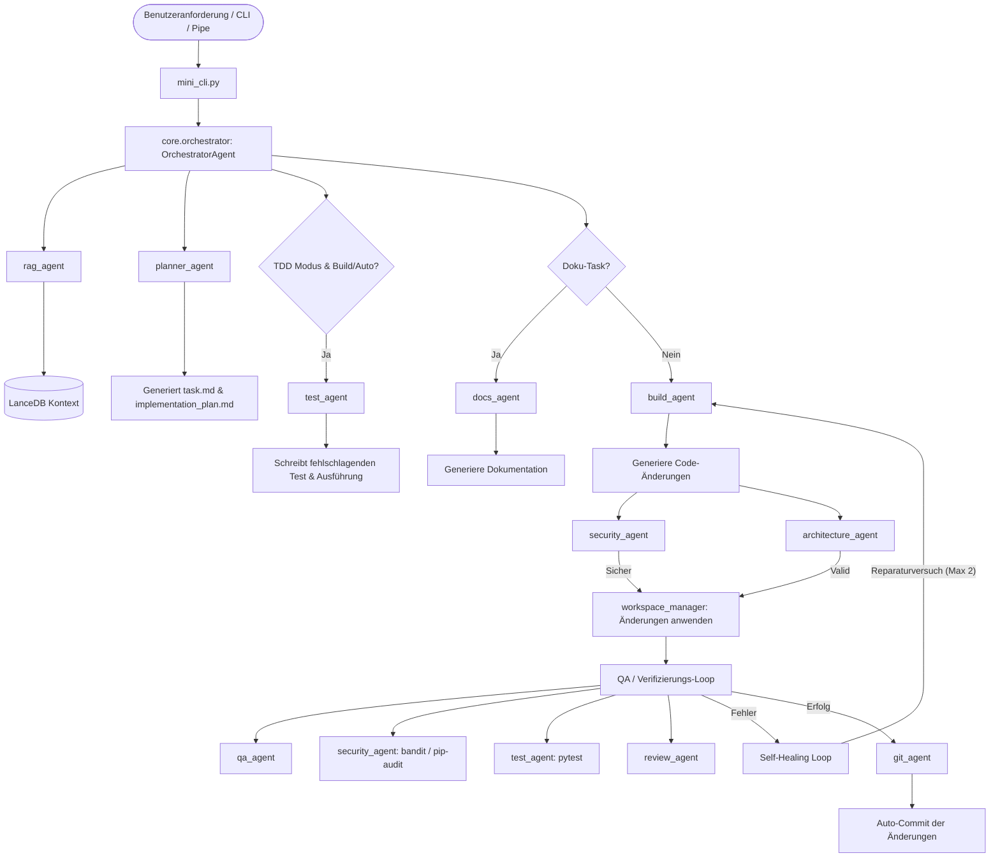

# 🌌 Mini-CLI Agent (v1.0)

[](#)
[](#)
[](#)

Mini-CLI ist ein autonomer, Multi-Agenten-KI-Programmierassistent zur Ausführung komplexer Softwareentwicklungsaufgaben. Gesteuert von einem zentralen Lead-Agenten (Orchestrator) koordiniert das System 21 spezialisierte Sub-Agenten, um Codebasen zu erstellen, zu testen, zu validieren und abzusichern. In einer asynchronen Ausführungsumgebung bietet Mini-CLI robuste Sicherheitsbeschränkungen, automatisierte Test-Driven Development (TDD) Pipelines, Self-Healing Loops (Selbstheilungsschleifen) und eine strikte Workspace-Isolierung.

---

## 🏗️ Systemarchitektur

Mini-CLI nutzt eine hierarchische Multi-Agenten-Struktur. Der **Orchestrator** verwaltet den globalen Zustand, überwacht den *Rate-Limit Guard*, plant dynamisch die spezialisierten Sub-Agenten und führt die TDD- und Self-Healing-Schleifen aus.



---

## ⚡ Hauptmerkmale

1. **Plan- vs. Build- vs. Auto-Modus**
   - **Plan (`plan`)**: Analysiert die Anforderung, ohne Dateien auf dem Datenträger zu verändern. Generiert eine detaillierte Aufschlüsselung der Aufgaben in `task.md` und `implementation_plan.md`.
   - **Build (`build`)**: Generiert Code und präsentiert die Änderungen interaktiv als Diff. Der Benutzer wird bei jeder Datei gefragt (`[y/n]`), ob die Änderungen übernommen werden sollen.
   - **Auto (`auto`)**: Vollautomatischer Modus. Zeigt Diffs an und schreibt Änderungen ohne interaktive Bestätigung direkt in die Dateien.
2. **Rollenbasierte Kollaboration & Semantisches Routing**
   - Zuteilung von Aufgaben an Sub-Agenten erfolgt über ein **LLM-basiertes semantisches Routing** (`_route_task_semantically`). Bei Netzwerkfehlern greift das System selbstheilend auf ein robustes Keyword-Match-Fallback zurück.
   - **Human-in-the-Loop (HITL):** Wenn Sub-Agenten während der Generierung zusätzliche Informationen benötigen, stellen sie über `[ASK_USER: <Frage>]` interaktive Rückfragen an den Benutzer, woraufhin der Orchestrator die Ausführung pausiert, die Antwort sammelt und die Arbeit fortsetzt.
3. **Sprachübergreifende Testautomatisierung & CI/CD-Linting**
   - Der `TestAgent` erkennt das Workspace-Projekt-Framework automatisch und führt Tests via `npm test` (Node.js), `go test ./...` (Go), `cargo test` (Rust), `phpunit` (PHP) oder standardmäßig `pytest` (Python) aus.
   - Der `CicdAgent` validiert GitHub Workflows (`.github/workflows/*.yml`) und GitLab CI/CD-Konfigurationen (`.gitlab-ci.yml`) auf YAML-Syntaxfehler sowie auf unpinned third-party Actions (Sicherheitsrisiko).
4. **Geschlossene Selbstheilungsschleife (Self-Healing Loop)**
   - Wenn Tests fehlschlagen, Syntaxfehler auftreten oder Sicherheitslücken gemeldet werden, analysiert der Orchestrator die Fehlerprotokolle und beauftragt den Agenten mit der automatischen Fehlerkorrektur (bis zu 2 Reparaturversuche).
5. **Sicherheits- & Architekturbarrieren**
   - **Workspace-Isolierung**: Verhindert, dass der Agent Dateien außerhalb des Workspace-Ordners liest, schreibt oder Befehle dort ausführt. *Der Agent darf sein eigenes Quellcodeverzeichnis (`mini-cli`) nicht als Arbeitsverzeichnis verwenden.*
   - **SAST- & Schwachstellen-Scans**: Automatische statische Code-Audits mittels **Semgrep** (tiefgehende statische Analysen), **Bandit** (Python-spezifisch) und Abhängigkeits-Audits via **pip-audit**.
   - **Schutz vor Hardcoded Secrets**: Erkennt und blockiert API-Keys, Tokens und Passwörter vor dem Speichern im RAM-only Modus und maskiert diese bei Datenbankeinträgen.
   - **Strukturelle Validierung**: Überprüft den Code auf Einhaltung von Design Patterns und Architektur-Prinzipien (SOLID, Clean Architecture) und blockiert unsauberen Code.
6. **Model Context Protocol (MCP) Integration**
   - Volle MCP-Unterstützung auf Basis des offiziellen `mcp`-SDKs zur Anbindung von stdio-basierten Servern (z. B. Jira, GitHub, Slack). Konfigurationen werden aus `.mini_cli_config.json` unter `"mcp_servers"` geladen.
7. **Lokale RAG-Vektordatenbank (LanceDB)**
   - Führt echte semantische Vektorsuchen in LanceDB über Kosinus-Ähnlichkeit (`cosine` metric) durch, die dynamisch über den aktiven Provider generiert werden. Fällt bei Ausfällen auf ein Keyword-Jaccard-Matching mit exponentiellem Recency-Decay (30 Tage Halbwertszeit) zurück.
8. **Language Server Protocol (LSP) Integration**
   - Startet im Hintergrund einen vollwertigen `pylsp`-Server. Löst Klassendefinitionen, Referenzen und Abhängigkeiten dynamisch auf, um dem Code-Generator präzisen Kontext zu liefern.
9. **Multi-Provider Fallbacks & Auto-Detection**
   - Unterstützt lokale Modelle (Ollama, LM Studio) und Cloud-Modelle (OpenAI, Anthropic, Gemini). Wechselt bei Ausfall automatisch auf einen verfügbaren und konfigurierten Provider.

---

## 🛠️ Spezialisierte Agenten-Matrix

Das System verwendet 21 Sub-Agenten, die bei Bedarf faul geladen (lazy-loaded) werden:

| Agenten-Name | Modul / Identifikator | Kernaufgabe |
| :--- | :--- | :--- |
| **Orchestrator** | `core.orchestrator` | Koordiniert Workflows, leitet TDD-Phasen und verwaltet die Selbstheilungsschleife. |
| **RAGAgent** | `agents.rag_agent` | Ruft semantischen Kontext aus der LanceDB-Datenbank ab. |
| **BuildAgent** | `agents.build_agent` | Generiert funktionalen Code und führt Implementierungen durch. |
| **QAAgent** | `agents.qa_agent` | Validiert die Syntax und führt Linters/Formatter aus. |
| **TestAgent** | `agents.test_agent` | Generiert Testumgebungen (z. B. Pytest) und führt Tests aus. |
| **GitAgent** | `agents.git_agent` | Erstellt semantische Git-Commits für durchgeführte Änderungen. |
| **ArchitectureAgent** | `agents.architecture_agent` | Validiert Code-Architektur (SOLID/Clean) und blockiert Spaghetti-Code. |
| **ResearchAgent** | `agents.research_agent` | Führt sichere Web-Recherchen mit DuckDuckGo APIs durch. |
| **SecurityAgent** | `agents.security_agent` | Scannt nach Hardcoded Secrets, Bandit-Fehlern und Paket-Schwachstellen. |
| **DocsAgent** | `agents.docs_agent` | Erstellt und pflegt Dokumentationen, Docstrings und Mermaid-Diagramme. |
| **ApiAgent** | `agents.api_agent` | Generiert API-Schemata, Typisierungen (TypeScript/Rust/Pydantic). |
| **BrowserAgent** | `agents.browser_agent` | Steuert Browser-Aktionen und Playwright/Cypress E2E-Tests. |
| **CicdAgent** | `agents.cicd_agent` | Analysiert Pipeline-Logs und behebt Fehler in CI/CD-Konfigurationen. |
| **DatabaseAgent** | `agents.database_agent` | Generiert risikofreie DB-Migrationen (SQL, Prisma, Alembic). |
| **DependencyAgent** | `agents.dependency_agent` | Verwaltet Bibliotheken und löst Versionskonflikte. |
| **DockerAgent** | `agents.docker_agent` | Erstellt optimierte Multi-Stage-Dockerfiles und Docker-Compose-Dateien. |
| **FrontendAgent** | `agents.frontend_agent` | Optimiert Stylesheets, CSS, Tailwind und Barrierefreiheit (A11y). |
| **PlannerAgent** | `agents.planner_agent` | Zerlegt Anforderungen in konkrete Milestones (`task.md`). |
| **ProfilerAgent** | `agents.profiler_agent` | Analysiert CPU-Auslastung, Memory Leaks und DB-Abfragegeschwindigkeiten. |
| **ReviewAgent** | `agents.review_agent` | Reviewt Code, vereinfacht komplexe Schleifen und beseitigt Code Smells. |
| **SkillCreatorAgent** | `agents.skill_creator_agent` | Lernt dynamisch neue CLI-Tools und fügt dem System neue Skills hinzu. |
| **VerifyAgent** | `agents.verify_agent` | Führt Systemprüfungen und Health-Checks aus. |

### 🔍 Detaillierte Funktionsweise der Agenten

Hier ist die detaillierte Funktionsweise der einzelnen Sub-Agenten und die verwendeten Tools/Verfahren:

#### Konfigurierbare Agenten (CLI-Auswahl):
1. **RagAgent (`agents/rag_agent.py`):**
   * **Funktionsweise:** Führt RAG-Abfragen (Retrieval-Augmented Generation) durch. Nutzt die lokale Vektordatenbank **LanceDB** sowie lokale Einbettungen (z. B. `nomic-embed-text` via Ollama), um für anstehende Aufgaben semantisch relevanten Code-Kontext aus dem Projekt zu laden.
2. **BuildAgent (`agents/build_agent.py`):**
   * **Funktionsweise:** Generiert den funktionalen Quellcode basierend auf Aufgabenbeschreibungen und Plänen. Nutzt ein spezielles Block-Format (`<<<FILE_START: ...>>>`) zur Datei-Erstellung und enthält Guards gegen Path Traversal sowie einen fehlertoleranten JSON-Fallback-Parser (`json-repair`).
3. **TestAgent (`agents/test_agent.py`):**
   * **Funktionsweise:** Schreibt in der TDD-RED-Phase automatisierte Unittests (z. B. mit `pytest`), führt die gesamte Testsuite asynchron in einer Sandbox-Umgebung aus und meldet Fehlschläge zur Selbstheilung zurück.
4. **ArchAgent / ArchitectureAgent (`agents/architecture_agent.py`):**
   * **Funktionsweise:** Überprüft vorgeschlagene Code-Änderungen auf Design Patterns (SOLID, Clean Architecture, Separation of Concerns) und blockiert Spaghetti-Code oder zirkuläre Abhängigkeiten mit einem `FAIL`.
5. **DocsAgent (`agents/docs_agent.py`):**
   * **Funktionsweise:** Generiert READMEs, fügt Docstrings in den Quellcode ein und erstellt Mermaid.js-Diagramme zur Visualisierung von Datenflüssen und Systemarchitekturen.
6. **ApiAgent (`agents/api_agent.py`):**
   * **Funktionsweise:** Analysiert Schnittstellen oder Datenstrukturen und generiert typsichere Definitionen (z. B. TypeScript-Interfaces, Rust-Structs) sowie Validierungs-Code (Pydantic-Modelle, Zod-Schemas).
7. **BrowserAgent (`agents/browser_agent.py`):**
   * **Funktionsweise:** Generiert Playwright- oder Cypress-Tests für User Journeys und führt diese im Headless-Browser aus, um UI-Integrität und visuelle Darstellungen abzusichern.
8. **CicdAgent (`agents/cicd_agent.py`):**
   * **Funktionsweise:** Analysiert fehlerhafte Pipeline-Logs (z. B. GitHub Actions oder GitLab CI) und generiert konkrete YAML-Korrekturvorschläge.
9. **DbAgent / DatabaseAgent (`agents/database_agent.py`):**
   * **Funktionsweise:** Generiert relationale Migrationsskripte (SQL, Alembic, Prisma) für Up- und Down-Migrationen (sichere Rollbacks ohne Datenverlust) und schlägt Indizes zur Optimierung vor.
10. **DepAgent / DependencyAgent (`agents/dependency_agent.py`):**
    * **Funktionsweise:** Scannt Dependency-Dateien (z. B. `requirements.txt`, `package.json`) auf veraltete Module, Versionskonflikte ("Dependency Hell") und CVEs.
11. **DockerAgent (`agents/docker_agent.py`):**
    * **Funktionsweise:** Erstellt optimierte Multi-Stage-Dockerfiles und Docker-Compose-Dateien (unter Verwendung von Alpine/Distroless-Images und non-root Usern).
12. **FrontendAgent (`agents/frontend_agent.py`):**
    * **Funktionsweise:** Überprüft den UI-Code auf visuelle Hierarchie, responsive Layouts (Mobile-First) und Barrierefreiheit (A11y/ARIA-Attribute, Tastaturnavigation).
13. **PlannerAgent (`agents/planner_agent.py`):**
    * **Funktionsweise:** Zerlegt Anforderungen in Meilensteine und generiert/pflegt die Steuerungsdateien `task.md` (Scope) und `implementation_plan.md` (Entwickler-Checkliste).
14. **ProfilerAgent (`agents/profiler_agent.py`):**
    * **Funktionsweise:** Analysiert den Code statisch auf Performance-Engpässe wie ineffiziente Algorithmen (z. B. O(N²)-Schleifen), Lookups und Memory Leaks.
15. **ReviewAgent (`agents/review_agent.py`):**
    * **Funktionsweise:** Führt Code-Reviews in vier Kategorien durch (Sicherheit, Architektur, Logik/Performance, Konventionen). Bei Funden der Stufe `[KRITISCH]` oder `[WARNUNG]` blockiert er die Integration und steuert die Selbstheilung.
16. **SkillAgent / SkillCreatorAgent (`agents/skill_creator_agent.py`):**
    * **Funktionsweise:** Entwirft auf Basis neuer Anforderungen selbstständig den Python-Code für neue Sub-Agenten, bindet diese nach HITL-Freigabe des Benutzers ins System ein und prüft dabei Pfadsicherheiten.

#### Weitere System-Agenten:
* **QAAgent (`agents/qa_agent.py`):** Führt statische Codeanalyse und automatische Formatierung über `Ruff` aus.
* **SecurityAgent (`agents/security_agent.py`):** Scannt Codeänderungen im RAM auf hardcodierte Secrets und führt Sicherheits-Audits mit `Bandit` sowie Paketprüfungen auf Sicherheitslücken mit `pip-audit` durch.
* **ResearchAgent (`agents/research_agent.py`):** Führt sichere Web-Recherchen via DuckDuckGo durch und bereinigt die Suchergebnisse vor der Weitergabe an LLMs zum Schutz vor Prompt Injections.
* **VerifyAgent (`agents/verify_agent.py`):** Führt System-Health-Checks aus (Prüfung auf `.env`-Konfigurationen und erfolgreiche Python-Kompilierung mittels `compileall`).
* **GitAgent (`agents/git_agent.py`):** Bereitet automatische Commits vor und checkt geänderte Dateien nach Bestätigung ein.

---

## 🔒 Sicherheitsarchitektur Token

Mini-CLI ist nach dem Prinzip "Security-by-Design" entworfen, um sicherzustellen, dass sensible API-Schlüssel (wie `GEMINI_API_KEY`, `OPENAI_API_KEY` und `ANTHROPIC_API_KEY`) zu keinem Zeitpunkt gefährdet oder unabsichtlich geleakt werden:

1. **In-Memory-Verarbeitung (RAM-only)**: Alle API-Schlüssel werden ausschließlich im Arbeitsspeicher des laufenden Python-Prozesses gehalten und über sichere HTTPS-Verbindungen an die offiziellen Provider-Endpunkte übertragen. Sie werden niemals in lokalen Datenbanken (z. B. LanceDB), Protokolldateien oder Telemetriedaten gespeichert.
2. **Workspace-Isolierung**: Der Agent darf seinen eigenen Quellcode-Ordner nicht als Arbeitsverzeichnis nutzen. Dies verhindert, dass der Agent Zugriff auf lokale Konfigurationsdateien (wie `.env`) erhält, diese ausliest oder versehentlich in Repositories eincheckt.
3. **Automatischer Secret-Scanner (`Security-Agent`)**: Vor jedem Schreibzugriff analysiert der `Security-Agent` alle vorgeschlagenen Codeänderungen im RAM auf verdächtige Muster (z. B. hardcodierte API-Schlüssel oder Passwörter). Wird ein potenzieller Key erkannt, blockiert das System die Änderung und bricht die Ausführung ab.
4. **Isolierte Container-Ausführung**: Über die bereitgestellte Docker-Umgebung (`docker-compose.yml`) können Schlüssel sicher über Umgebungsvariablen an den isolierten Container durchgereicht werden, ohne das lokale Dateisystem zu kompromittieren.

*Tipp: Wir empfehlen zusätzlich, API-Keys in den jeweiligen Cloud-Konsolen (z. B. Google AI Studio) mit Quota-Limits (Tagesbudgets) zu versehen und ausschließlich für die benötigten Modell-APIs freizugeben.*

---

## 🚀 Schnellstart-Anleitung

### 1. Systemvoraussetzungen & Abhängigkeiten
- Python 3.10 oder höher.
- Unter Linux (z. B. Bazzite / Fedora / Ubuntu) sicherstellen, dass `python3-pip` und `git` installiert sind.
- (Optional) Language Server Protocol: `python-lsp-server` (kann per `pip` installiert werden).

### 2. Installation
Repository klonen und virtuelle Umgebung einrichten:
```bash
git clone https://github.com/dein-benutzername/mini-cli.git
cd mini-cli
python -m venv .venv
source .venv/bin/activate
pip install -r requirements.txt
```

### 3. Konfiguration der LLM-Provider
Umgebungsvariablen für die gewünschten APIs setzen:
```bash
# Cloud-Provider
export GEMINI_API_KEY="dein-gemini-key"
export ANTHROPIC_API_KEY="dein-anthropic-key"
export OPENAI_API_KEY="dein-openai-key"

# Lokale Provider (Sicherstellen, dass Ollama oder LM Studio läuft)
# Ollama: Standard-Endpunkt http://localhost:11434
# LM Studio: Standard-Endpunkt http://127.0.0.1:1234
```

---

## 📖 Bedienungsanleitung

Der Mini-CLI Agent kann im **Direktbefehls-Modus** oder im **interaktiven REPL-Modus** gestartet werden.

### A. Direktbefehls-Modus (CLI)
Führe eine einzelne Aufgabe direkt aus der Shell aus:

```bash
# Anforderung analysieren und Entwicklungsplan erstellen (Standard: Plan-Modus)
python mini_cli.py "Erstelle ein Web-Scraper-Tool in Python" --mode plan

# Code generieren und interaktiv im Build-Modus anwenden
python mini_cli.py "Schreibe eine Klasse zur Berechnung von Fibonacci-Folgen" --mode build --provider openai

# Komplett autonom arbeiten (Yolo-Mode) mit Gemini als LLM
python mini_cli.py "Refaktoriere DB-Verbindungen auf Context Manager" --mode auto --provider gemini
```

#### UNIX-Pipes Support
Du kannst Inhalte direkt in die CLI pipen:
```bash
cat error.log | python mini_cli.py "Erkläre, warum dieser Stacktrace fehlgeschlagen ist" --mode plan
```

---

### B. Interaktiver REPL-Modus
Starte die interaktive Konsole ohne Aufgabenbeschreibung:
```bash
python mini_cli.py
```

Beim Start wirst du gefragt, ob ein bestehender Workspace-Ordner geladen oder ein neuer erstellt werden soll. **Wichtige Einschränkung: Du darfst nicht den Quellcode-Ordner des Agenten (`mini-cli`) als Workspace nutzen.**

#### REPL Slash-Befehle
Tippe `/help` in das REPL ein, um die Befehlsübersicht zu öffnen:

| Befehl | Argument | Beschreibung |
| :--- | :--- | :--- |
| `/help` | Keine | Zeigt die Hilfe und die verfügbaren Slash-Befehle. |
| `/provider` | `<name>` | Wechselt den LLM-Provider (`ollama`, `gemini`, `anthropic`, `openai`, `lmstudio`). |
| `/mode` | `<name>` | Ändert den Ausführungsmodus (`plan`, `build`, `auto`). |
| `/language` | `<lang>` | Wechselt die CLI-Sprache (`en`, `de`). |
| `/verify` | Keine | Führt eine vollständige System-Verifizierung aus. |
| `exit` oder `quit` | Keine | Beendet die interaktive Konsole. |

---

## 📈 Telemetrie-Dashboard

Nach der Ausführung einer Aufgabe zeigt Mini-CLI eine Zusammenfassung im Terminal-Footer an:

- **Tokens Verbraucht**: Zählt verbrauchte API-Tokens zur Kostenkontrolle.
- **Cache-Hits**: Zeigt gecachte Tokens (optimiert für Gemini/Claude).
- **Provider**: Gibt das aktuell genutzte LLM-Modell aus.

---

## 🗄️ RAG-Datenbank befüllen (Seeding)
Um die RAG-Datenbank mit SWE-bench-Aufgaben und -Lösungen zu befüllen (z. B. für Tests oder zur Bereitstellung von Kontext), muss das Seeding-Skript manuell im Terminal ausgeführt werden:
```bash
python tools/seed_rag.py --limit 100 --offset 400
```
Hierbei steht `--limit` für die Anzahl der zu importierenden Einträge und `--offset` für den Startindex im SWE-bench-Datensatz.

## 🧪 Unit-Tests ausführen
Um sicherzustellen, dass alle Core- und Sub-Agenten-Schnittstellen fehlerfrei funktionieren, führe die Testsuite aus:
```bash
pytest test_agents.py
```
